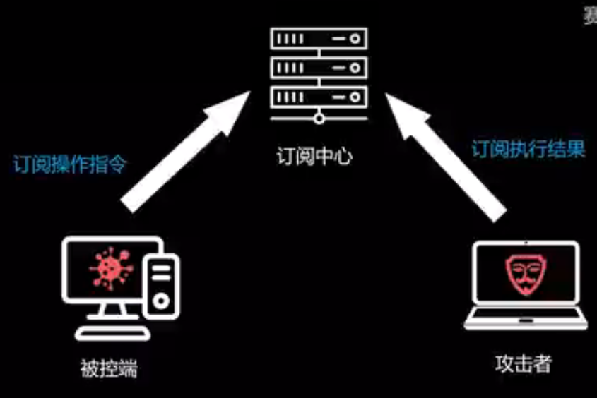

# 教师助手

这是一个用于帮助老师的小工具

远程控制的思路如下：

## 学生端
    
### 网络逻辑
接收来自服务器端的消息，执行。

接收的消息有两种：

1. system消息，包括
    1. ``exit``命令，退出学生端
    2. ``messadge``命令，弹窗显示消息，可关闭
2. powershell消息
    执行powershell命令，将执行结果发给服务器
### 本地逻辑
    
本地执行的逻辑

1. 拔网线检测，通过ping本机IP地址或其他方法实现
2. 检测极域电子教室是否运行（`StudentMain.exe`）如果被关闭则重新打开

实现目标：
服务器端：获取来自教师端的cmd命令，发送到在线学生端，获取来自学生端的执行结果，发送给教师端

要求学生端在后台隐藏运行